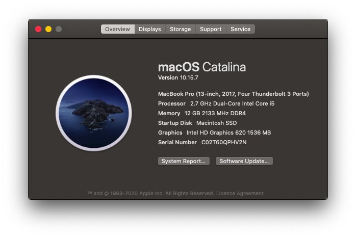
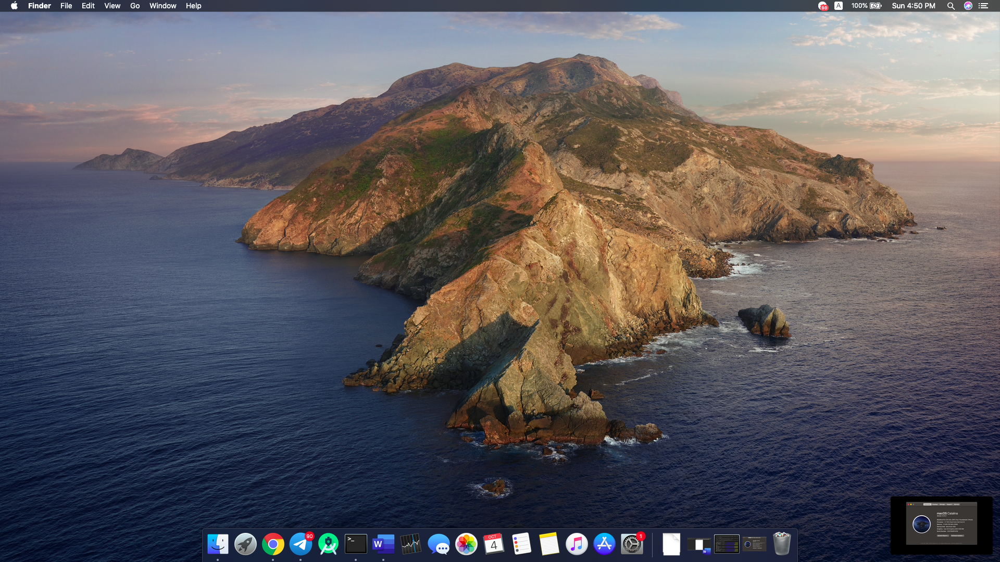

# Lenovo-Hackintosh


# Catalina 10.15.7 (OpenCore - Vanilla)
##### Hackintosh OpenCore Configuration for Ideapad 510-15IKB

## Specifications
Intel Core i5 7200U, Intel HD Graphics 620, 12 GB 2133 MHz DDR4 Memory, Crucial MX500 SSD

##  Screenshot




## BIOS Settings (Latest BIOS from Offical Lenovo)

```
Wireless LAN [Enabled]
Graphic Device [Discrete]
Power Beep [Disabled]
Intel Virtualization Technology [Enabled]
BIOS Back Flash [Enabled]
Hotkey Mode [Disabled]
Intel Platform Trust Technology [Enabled]
Intel SGX [Software Controlled]
Secure Boot [Disabled]
Boot Mode [UEFI]
Fast Boot [Disabled]
USB Boot [Enabled]
PXE Boot to LAN [Enabled]
IPV4 PXE First [Enabled]
```

## Installation
1. Please see the OpenCore USB Creation guide [here](https://dortania.github.io/OpenCore-Install-Guide/installer-guide)
2. Once you have a macOS USB with OpenCore created, mount your USB's newly created EFI/"BOOT" paritition
3. Delete all files in this partition and copy over the BOOT folder's contents from this repo to it
4. Rename `EFI/OC/config.plist.install` to `EFI/OC/config.plist`
5. Boot the installer, and install macOS
6. Mount the USB drive's EFI/"BOOT" on another machine
7. Remove `EFI/OC/config.plist` and rename `EFI/OC/config.plist.boot` to `EFI/OC/config.plist`
8. Boot up macOS using the USB and verify everything works properly
9. Use MountEFI to mount the APFS partition's BOOT/EFI container and copy over your USB's EFI directory to it (Alternatively, see [this](https://dortania.github.io/OpenCore-Post-Install/universal/oc2hdd.html))
10. Boot without the USB drive, profit!

## Working
1. FN + F1/F2/F3/F6/F11/F12
2. HD Graphics 620
3. Sound
4. TouchPad with Multi-Gesture
5. Power Management & Battery Status
6. Brightness

## Not Working
1. Wireless Card
2. SD Card Reader

## Solution for Wireless Card & SD Card Reader
1. [Asus USB-N10 NANO](https://www.asus.com/Networking/USBN10_NANO/)
2. [BLUEENDLESS Type C to 3*USB 3.0/SD/TF Card Reader](https://tr.banggood.com/Blueendless-HC401-9-in-1-Type-C-to-3-Port-USB-3_0-HDMI-SD-TF-Card-Reader-Data-Hub-p-1555789.html?cur_warehouse=CN) + USB Type C to USB 3.0 Converter


## Important Note
The install instructions are for the same Laptop model (Lenovo Ideapad 510-15IKB). For other laptops, before proceeding, you may have to regenerate your DSDT and replace it in `EFI/OC/ACPI`. As always, know your hardware and make sure to review the config.plist thoroughly. Do NOT blindly use configs on other models!
